  

  

 

  

Most of what I build starts with the same question: **does this actually work, or does it just look like it does?**
That question became **Verdict** — a self-hosted verifier that tests AI-generated code before a human has to. It shows up everywhere else I build too: agentic pipelines that reason over real data, full-stack platforms with architecture that holds up past the demo, and tools built to disappear into someone's workflow rather than demand attention.

 

 

  

<b>LANGUAGES</b>
 

  

<b>BACKEND</b>
 

  

<b>FRONTEND</b>
 

  

<b>INFRASTRUCTURE</b>
 

  

<b>DATABASES</b>
 

  

<b>CLOUD</b>
 

  

<b>AI / ML</b>
 

  

<b>DEVOPS</b>
 

  

<b>TOOLS</b>
 

 

 

  

<table>
<tr>
<td width="50%" valign="top">

### [Verdict](https://github.com/anxmeshhh/verdict)
Self-hosted verifier that proves an AI-generated (or human) code change does what it claims — deterministic pipeline, sandboxed test execution, only two narrow LLM steps by design.

 

**[View Repository ↗](https://github.com/anxmeshhh/verdict)**

</td>
<td width="50%" valign="top">

### [QueryMind](https://github.com/anxmeshhh/QueryMind)
Agentic database engineering platform — an 11-agent pipeline that scans codebases, connects live databases, and delivers schema-safe query optimizations, streamed in real time.

  

**[View Repository ↗](https://github.com/anxmeshhh/QueryMind)**

</td>
</tr>
<tr>
<td width="50%" valign="top">

### [CropFlow](https://github.com/anxmeshhh/CropFlow)
Agentic AI farm simulator — multiple autonomous agents that learn, negotiate, and make independent decisions inside a simulated economy.

 

**[View Repository ↗](https://github.com/anxmeshhh/CropFlow)**

</td>
<td width="50%" valign="top">

### [GrowthOS](https://github.com/anxmeshhh/GrowthOS)
A full-stack operating system for deliberate skill growth — spaced repetition, AI mock interviews, GitHub portfolio analysis, and career-gap mapping, unified instead of scattered.

 

**[View Repository ↗](https://github.com/anxmeshhh/GrowthOS)**

</td>
</tr>
<tr>
<td width="50%" valign="top">

### [SyncBeats](https://github.com/anxmeshhh/SyncBeats)
Real-time, room-based music sync — zero-proxy streaming architecture and lock-step playback across every listener's device.

 

**[View Repository ↗](https://github.com/anxmeshhh/SyncBeats)**

</td>
<td width="50%" valign="top">

### [mobiCLI](https://github.com/anxmeshhh/mobiCLI)
A multi-terminal web shell you can drive from your phone — live mirroring, an installable PWA, IDE-style tabs.

 

**[View Repository ↗](https://github.com/anxmeshhh/mobiCLI)**

</td>
</tr>
</table>

 

 

  

<table>
<tr>
<td width="50%">

</td>
<td width="50%">

</td>
</tr>
</table>

 

<b>ACTIVITY</b>

 

<b>CONTRIBUTION CALENDAR</b>
 

 

 

  

 

### Contribution Snake

<picture>
  <source media="(prefers-color-scheme: dark)" srcset="https://raw.githubusercontent.com/anxmeshhh/anxmeshhh/output/github-contribution-grid-snake-dark.svg" />
  
</picture>

Regenerated daily by a GitHub Action, themed indigo → violet → blue → cyan to match the rest of the page.

  

<!--
Optional — wire these up once connected, then drop the 
 wrapper:

WakaTime (needs github.com/anmol098/waka-readme-stats action + your WakaTime API key):
https://github.com/anmol098/waka-readme-stats

Spotify Now Playing (needs your own deploy of kittinan/spotify-github-profile):

-->

 

  

  

Software should be trusted, not just deployed.

