 

  

 

  

**Building products that deserve to exist.**

Building software that solves real problems.

Focused on developer tools, AI systems, backend engineering, and scalable full-stack applications. Passionate about transforming ambitious ideas into polished products through thoughtful architecture, clean code, and great developer experience.

 

 

  

<b>LANGUAGES & AI / ML</b>
 

  

<b>FRONTEND & BACKEND</b>
 

  

<b>DATA, CLOUD & INFRA</b>
 

  

<b>TOOLS & DEVOPS</b>
 

 

 

  

<table>
<tr>
<td width="50%" valign="top">

### [Verdict](https://github.com/anxmeshhh/verdict)
Self-hosted verifier that proves an AI-generated (or human) code change does what it claims — deterministic pipeline, sandboxed test execution, only two narrow LLM steps by design.

 

**[View Repository ↗](https://github.com/anxmeshhh/verdict)**

</td>
<td width="50%" valign="top">

### [AgentRouteAI](https://github.com/anxmeshhh/Agent_Route_AI)
Agentic AI system that predicts shipment delay and routing risk in real time — Groq-powered LLaMA 3 reasoning over a Flask + MySQL backend, containerized.

   

**[View Repository ↗](https://github.com/anxmeshhh/Agent_Route_AI)**

</td>
</tr>
<tr>
<td width="50%" valign="top">

### [ElectaVerse](https://github.com/anxmeshhh/Google-Prompt-Wars---Election-System)
Real-time agentic election-intelligence platform — Gemini-powered analysis over a React front end, deployed live on GCP.

  

**[View Repository ↗](https://github.com/anxmeshhh/Google-Prompt-Wars---Election-System)** · **[Live Demo ↗](https://electaverse.web.app)**

</td>
<td width="50%" valign="top">

### [SyncBeats](https://github.com/anxmeshhh/SyncBeats)
Real-time, room-based music sync — zero-proxy streaming architecture and lock-step playback across every listener's device.

 

**[View Repository ↗](https://github.com/anxmeshhh/SyncBeats)**

</td>
</tr>
</table>

 

 

  

<table>
<tr>
<td width="50%">

</td>
<td width="50%">

</td>
</tr>
</table>

 

<b>ACTIVITY</b>

 

<b>CONTRIBUTION CALENDAR</b>
 

 

<b>CONTRIBUTION SNAKE</b>
 
<picture>
  <source media="(prefers-color-scheme: dark)" srcset="https://raw.githubusercontent.com/anxmeshhh/anxmeshhh/output/github-contribution-grid-snake-dark.svg" />
  
</picture>

 

 

  

  

Software should be trusted, not just deployed.

