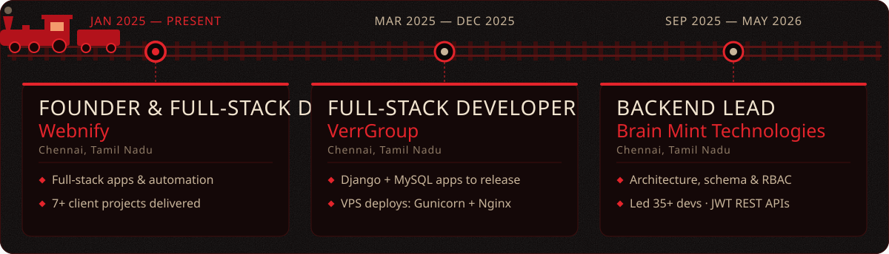
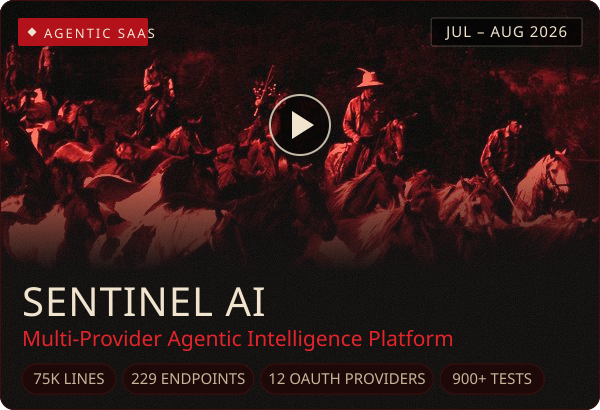
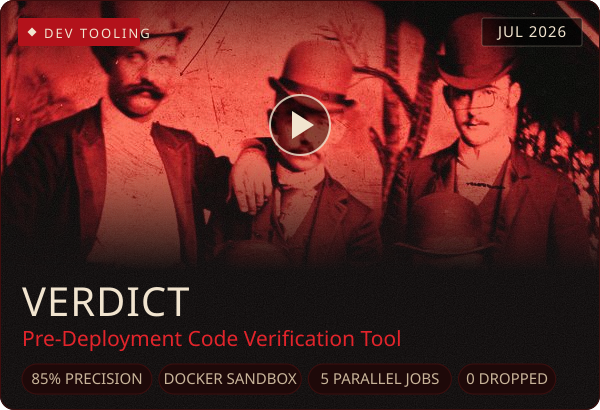
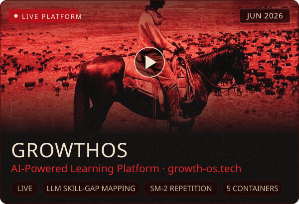
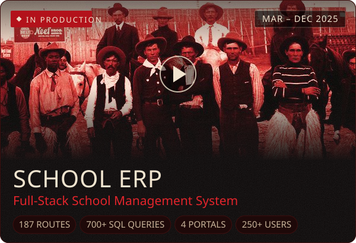

 

 

 

<table>
<tr>
<td width="38%" valign="middle" align="center">

</td>
<td width="62%" valign="middle">

### Professional summary

**Software Engineer** with experience across the full **SDLC**, from development and testing to deployment, building scalable, high-performance backend systems with **Python, SQL and REST APIs**. Experienced in containerization, orchestration, **CI/CD**, DevOps and cloud deployment. Focused on **AI/LLM engineering** and **agentic systems**, shipped reliably to production.

**Founder** of **Webnify**: full-stack apps and workflow automation, 7+ client projects delivered 
**Former Backend Lead** at **Brain Mint Technologies**: led a team of 35+ developers 
**B.Tech CSE (AI & ML)** at **SRM IST**: CGPA **9.66 / 10**, graduating 2027 
**Based in** Chennai, India 
**Open to** software engineering, backend and AI/LLM engineering roles

> *"The LLM proposes, it never executes."* That rule runs through every agentic system I build: narrow, validated model steps, with deterministic code, sandboxes and tests doing the real work.

</td>
</tr>
</table>

 



  

<b>SIDEARMS · LANGUAGES</b> 
&nbsp;
&nbsp;
&nbsp;
&nbsp;
&nbsp;
&nbsp;
&nbsp;

 <b>LONG ARMS · BACKEND & FRONTEND</b> 
&nbsp;
&nbsp;
&nbsp;
&nbsp;
&nbsp;

 <b>PROVISIONS · DATABASES & DATA</b> 
&nbsp;
&nbsp;
&nbsp;
&nbsp;

 <b>HORSE & TACK · DEVOPS & CLOUD</b> 
&nbsp;
&nbsp;
&nbsp;
&nbsp;
&nbsp;
&nbsp;
&nbsp;

 <b>DEAD EYE · AI / ML</b> 
&nbsp;
&nbsp;
&nbsp;
&nbsp;

 

Also carried: Generative AI · Prompt Engineering · Unit, Integration & API Testing · Test Automation · API Security · System Design · DSA · DBMS · OS · Networks

 

<table>
<tr>
<td width="50%" valign="top">
<a href="https://github.com/anxmeshhh/Sentinel-AI"></a>

Solo-built agentic SaaS platform: **FastAPI + React**, 229 REST endpoints, a 39-table schema and 12 OAuth 2.0 providers feeding 22 rule-based detection engines. 40 agent actions with 32 undo paths and idempotency keys. **The LLM proposes, never executes.**

**[Open the case file ↗](https://github.com/anxmeshhh/Sentinel-AI)**
</td>
<td width="50%" valign="top">
<a href="https://github.com/anxmeshhh/verdict"></a>

pip-installable **Python CLI** that tests code diffs against their stated intent in **Docker sandboxes** and rates the risk. Only two narrow, validated LLM steps. **85% precision** on 25 real commits, scaled with Redis/Celery, PostgreSQL and GitHub Actions CI.

**[Open the case file ↗](https://github.com/anxmeshhh/verdict)**
</td>
</tr>
<tr>
<td width="50%" valign="top">
<a href="https://growth-os.tech"></a>

Live platform that gets students job-ready: paste a job description and an LLM maps it against your progress for a **match score, missing skills and a study plan**. SM-2 spaced repetition, AI mock interviews. **DRF, React + TS, MySQL, Redis**, 5 Docker containers behind Nginx.

**[Ride to growth-os.tech ↗](https://growth-os.tech)** · **[Repository ↗](https://github.com/anxmeshhh/GrowthOS)**
</td>
<td width="50%" valign="top">
<a href="https://github.com/anxmeshhh/School-Management-System-Fully-Fledged-"></a>

School ERP in **Django + MySQL** with portals for admins, teachers, students and parents across 187 routes. 700+ hand-tuned SQL queries, Excel-to-SQL bulk import, QR ID cards, PDF progress cards, e-signature approvals and WhatsApp alerts. **Live for 250+ users.**

**[Open the case file ↗](https://github.com/anxmeshhh/School-Management-System-Fully-Fledged-)**
</td>
</tr>
</table>

<b>More jobs on the board</b>

 

| Job | What it does |
|---|---|
| [**AgentRoute AI**](https://github.com/anxmeshhh/Agent_Route_AI) | Multi-agent shipment delay & routing risk prediction. HackStorm 2nd Runner-Up |
| [**ElectaVerse**](https://github.com/anxmeshhh/Google-Prompt-Wars---Election-System) | Gemini-powered election-intelligence platform, [live](https://electaverse.web.app) (Google Prompt Wars) |
| [**ChessSense AI**](https://github.com/anxmeshhh/chesssense-ai) | Neural chess engine: ResNet policy/value net + MCTS, game review and a Lichess bot |
| [**Crop-Disease Forecasting**](https://github.com/anxmeshhh/Physics-Informed-ViT-Graph-for-Crop-Disease-Forecasting) | Physics-informed ViT + wind-aware farm graph, 1–7 day disease-risk forecasts |
| [**QueryMind**](https://github.com/anxmeshhh/QueryMind) | Agentic SQL platform: an 11-agent pipeline that finds, scores and safely rewrites queries, [live](https://querymind.aidatabase.workers.dev/)|
| [**mobiCLI**](https://github.com/anxmeshhh/mobiCLI) | Multi-terminal web shell you control from your phone: live mirroring, PWA, IDE-style tabs |

 



  



<table>
<tr>
<td width="50%"></td>
<td width="50%"></td>
</tr>
</table>



<picture>
  <source media="(prefers-color-scheme: dark)" srcset="https://raw.githubusercontent.com/anxmeshhh/anxmeshhh/output/github-contribution-grid-snake-dark.svg" />
  
</picture>

  

 

  



Theme inspired by the art direction of Red Dead Redemption 2. Original artwork, not affiliated with Rockstar Games.

